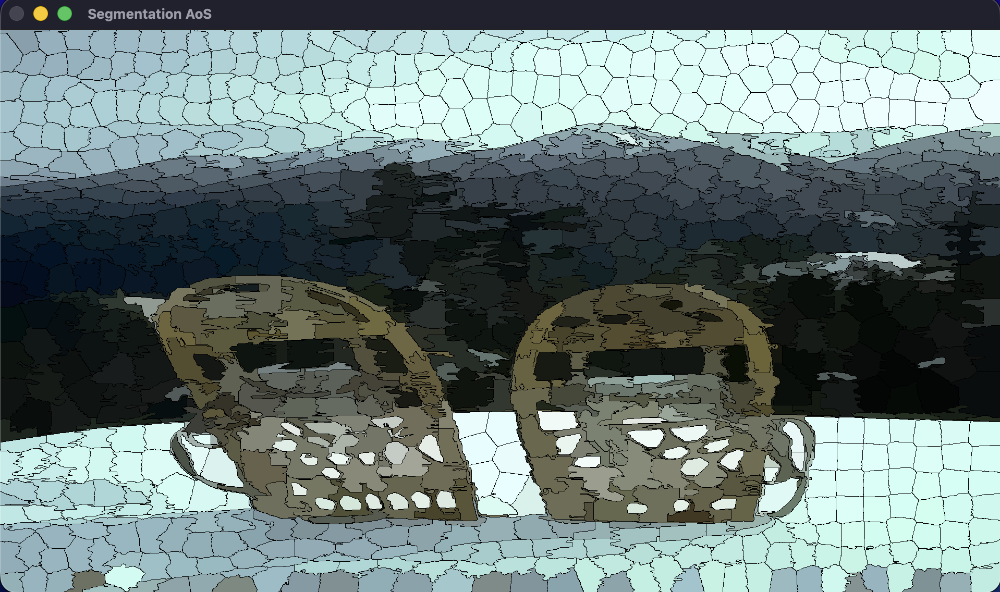

# Parallel SLIC Superpixels

In this repository, there is a analisys of a segmentation algorithm using in the Computer Vision to make a segmentation preserving the boundaries of the original image. The complexity of the algorithm is $O(N)$ where N is the number of pixels. 
The principal goal of the repository is to try accellerate the algorithm using multithreading of the CPU with the OpenMP framework.
Here below, there are the original photo and the segmented photo.




## Optimization Tecniques
The implementation uses an executable benchmark to analyze and identify the best configuration to improve performance. This analysis includes:
- **Best number of threads:** Understanding the optimal number of threads to execute the algorithm with the highest speedup.
- **Memory Layout:** A performance comparison between Array of Structures (AoS) and Structure of Arrays (SoA).
- **Synchronization:** Implementation strategies to avoid race conditions, comparing `Atomics` vs `Reduction`.
- **OpenMP Scheduling:** Performance analysis varying the scheduling policies (`static`, `dynamic`, `guided`) and chunk dimensions.


## System Requirements
To run the code, the user must have:
* A C++ Compiler with OpenMP support (e.g., `g++` or `clang++`).
* OpenCV library to load and process the images.
* Python 3.x with `pandas`, `matplotlib`, and `seaborn` to generate all the plots.

## Compilation
If the user want to build and execute the benchmark must use these rows:
```bash
mkdir build && cd build
cmake ..
make
./SLIC_Benchmark 
```
After that the user have to install the requirements and then generate the plots using this row:
```bash
pip install -r scripts/requirements.txt
python scripts/graphs_generator.py 
```
