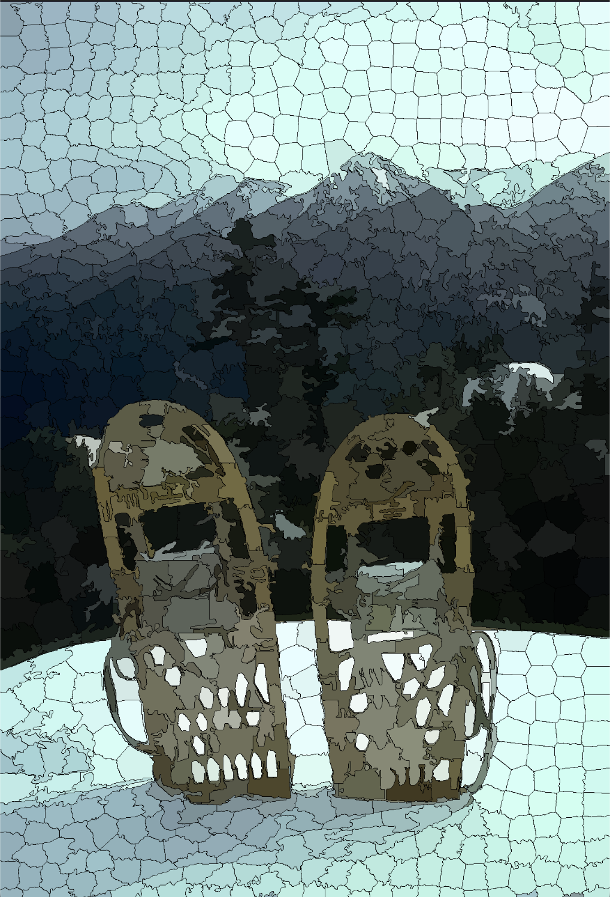

# Parallel SLIC Superpixels

In this repository, there is a analysis of a segmentation algorithm using in the Computer Vision to make a segmentation preserving the boundaries of the original image. The complexity of the algorithm is $O(N)$ where N is the number of pixels. 
The principal goal of the repository is to try accellerate the algorithm using multithreading of the CPU with the OpenMP framework.
Here below, there are the original photo and the segmented photo.
| Original Image | Segmented Image |
|---------------|----------------|
|  |  |

## Optimization Tecniques
The implementation uses an executable benchmark to analyze and identify the best configuration to improve performance. This analysis includes:
- **Best number of threads:** Understanding the optimal number of threads to execute the algorithm with the highest speedup.
- **Memory Layout:** A performance comparison between Array of Structures (AoS) and Structure of Arrays (SoA).
- **Synchronization:** Implementation strategies to avoid race conditions, comparing `Atomics` vs `Reduction`.
- **OpenMP Scheduling:** Performance analysis varying the scheduling policies (`static`, `dynamic`, `guided`) and chunk dimensions.
- **Tiling Tecnique**: Using the tiling tecnique to improved the Temporal Locality instead of Spatial Locality (Without Tiling).


## Project Structure

- **`Documentation/`**: Contains the detailed project documentation, including the academic report (LaTeX sources / PDF) that describes the architectural analysis, optimization strategies (AoS vs SoA, Tiling), and conclusions.
- **`all_benchmark_results/`**: Collects the log files and raw data (e.g., CSV files) generated during the execution of the test suite across various resolutions and configurations (Atomics, Reductions, Thread count, Scheduling).
- **`generated_graphs/`**: Output directory for graphs and plots (e.g., speedup charts, Amdahl's Law, tiling impact) used in the report to visually validate performance.
- **`include/`**: Contains the C/C++ header files (`.h`) with the definitions of the main data structures (e.g., the `Array of Structures` and `Structure of Arrays` layouts for Pixels and Centroids) and classes for the implementation.
- **`scripts/`**: Includes auxiliary scripts, specifically the Python scripts developed for parsing the raw benchmark results and automatically generating matplotlib graphs.
- **`src/`**: The core of the project. Contains the C++ source code (`.cpp`) with the various implementations of the SLIC algorithm: the sequential baseline and the OpenMP parallel variants (Assignment Phase, Update Centroids).
- **`.gitignore`**: Git exclusion rules to avoid tracking temporary build files, binaries, or large unnecessary images.
- **`CMakeLists.txt`**: Configuration file for the CMake build system. It manages the project compilation by setting the necessary directives, aggressive optimization flags (such as `-O3` and `-ffast-math`), and linking with external libraries (OpenMP, OpenCV). (Commented as a reminder for all keywords).
- **`README.md`**: This file, which provides general instructions to compile the project, reproduce the experiments, and understand the project's scope.
- **`benchmark.cpp`**: The entry-point source file for profiling. It handles the setup of images at increasing resolutions (from 640x480 up to Full HD) and triggers the execution time measurements for the various implemented pipelines.


## System Requirements
To run the code, the user must have:
* A C++ Compiler with OpenMP support (e.g., `g++` or `clang++`).
* OpenCV library to load and process the images.
* Python 3.x with `pandas`,`numpy`, `matplotlib`, and `seaborn` to generate all the plots.
* OpenMP Library: Required for multi-threaded execution.
  Note for macOS users: Apple Clang does not include OpenMP by default. You can install it via Homebrew:
  ``` bash
   brew install libomp
  ```
* CMake (version 3.10 or higher): To manage the build process.

## Compilation and Execution
If the user want to build and execute the benchmark must use these rows:
```bash
mkdir build && cd build
cmake ..
make
./SLIC_Benchmark 
```
After that, the user have to install the requirements and then generate the plots using this row:
```bash
pip install -r scripts/requirements.txt
python scripts/graphs_generator.py 
```
